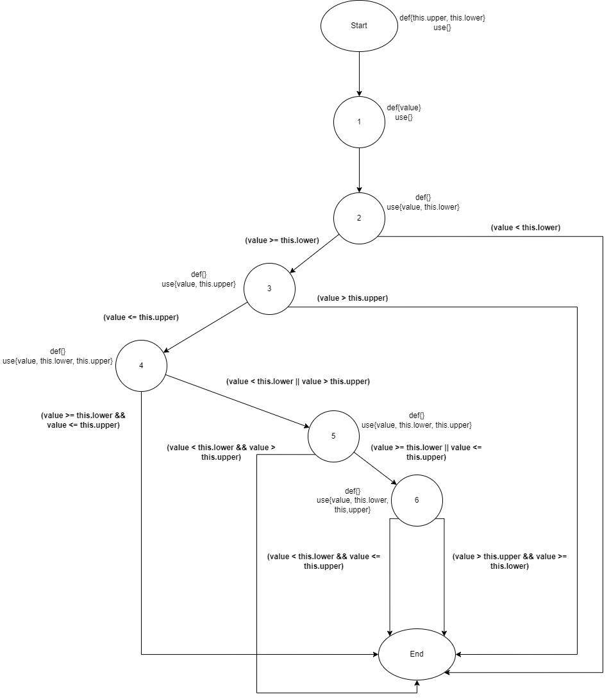

**SENG 438 - Software Testing, Reliability, and Quality**

**Lab. Report #3 – Code Coverage, Adequacy Criteria and Test Case Correlation**

| Group \#:      |  24  |
| -------------- | --- |
| Student Names: | Ahad Ali  |
|                | Mushtaba Al Yasseen  |
|                | Parbir Lehal |
|                | Athul Rajagopal |

(Note that some labs require individual reports while others require one report
for each group. Please see each lab document for details.)

# 1 Introduction

The objective of this lab is to explore the idea of white box testing using JUnit and different coverage tools. This will allow us to complete white box testing on our given test suite by verifying our Junit test. Additionally, coverage tools allow us to identify the amount of unit testing has been completed with our test cases, and what is remaining. This is indicated by the green and red colors, after running a coverage. Overall, we will be able to test the suite using different tools and approaches, allowing for a more thorough approach by testing all possible coding paths. 

# 2 Manual data-flow coverage calculations for X and Y methods
Methods: Range.contains() and DataUtilities.calculateColumnTotal()
## Range.contains()
### Dataflow Graph

### Def-path set
- du(start, this.upper) = { [start, 1, 2, 3], [start, 1, 2, 3, 4], [start, 1, 2, 3, 4, 5], [start, 1, 2, 3, 4, 5, 6] }
- du(start, this.lower) = { [start, 1, 2], [start, 1, 2, 3, 4], [start, 1, 2, 3, 4, 5], [start, 1, 2, 3, 4, 5, 6] }
- du(1, value) = { [1, 2], [1, 2, 3], [1, 2, 3, 4], [1, 2, 3, 4, 5], [start, 1, 2, 3, 4, 5, 6] }
### Def-pair set
- du(start, 3, this.upper) = { [start, 1, 2, 3] }
- du(start, 4, this.upper) = { [start, 1, 2, 3, 4] }
- du(start, 5, this.upper) = { [start, 1, 2, 3, 4, 5] }
- du(start, 6, this.upper) = { [start, 1, 2, 3, 4, 5, 6] }
- du(start, 2, this.lower) = { [start, 1, 2] }
- du(start, 4, this.lower) = { [start, 1, 2, 3, 4] }
- du(start, 5, this.lower) = { [start, 1, 2, 3, 4, 5] }
- du(start, 6, this.lower) = { [start, 1, 2, 3, 4, 5, 6] }
- du(1, 2, value) = { [1, 2] }
- du(1, 3, value) = { [1, 2, 3] }
- du(1, 4, value) = { [1, 2, 3, 4] }
- du(1, 5, value) = { [1, 2, 3, 4, 5] }
- du(1, 6, value) = { [1, 2, 3, 4, 5, 6] }
### DU-Pairs per Variable
| Variable (v) | Defined at node (n) | DU Pairs                                           |
| ------------ | ------------------- | -------------------------------------------------- |
| this.upper   | start               | { (start, 3), (start, 4), (start, 5), (start, 6) } |
| this.lower   | start               | { (start, 2), (start, 4), (start, 5), (start, 6) } |
| value        | 1                   | { (1, 2), (1, 3), (1, 4), (1, 5), (1, 6) }         |
### DU-Pairs per Test Case
| Test Case                                       | Pairs Covered                                                                                                                                             |
| ----------------------------------------------- | --------------------------------------------------------------------------------------------------------------------------------------------------------- |
| testGetContainsNumberExists()                   | du(start, 3, this.upper), du(start, 4, this.upper), du(start, 2, this.lower), du(start, 4, this.lower), du(1, 2, value), du(1, 3, value), du(1, 4, value) |
| testGetContainsNumberNotExistsLower()           | du(start, 2, this.lower), du(1, 2, value)                                                                                                                 |
| testGetContainsNumberNotExistsUpper()           | du(start, 3, this.upper), du(start, 2, this.lower), du(1, 2, value), du(1, 3, value)                                                                      |
| testGetContainsPositiveNumberExistsLowerBound() | du(start, 3, this.upper), du(start, 4, this.upper), du(start, 2, this.lower), du(start, 4, this.lower), du(1, 2, value), du(1, 3, value), du(1, 4, value) |
| testGetContainsPositiveNumberExistsUpperBound() | du(start, 3, this.upper), du(start, 4, this.upper), du(start, 2, this.lower), du(start, 4, this.lower), du(1, 2, value), du(1, 3, value), du(1, 4, value) |
| testGetContainsNegativeNumberExistsLowerBound() | du(start, 3, this.upper), du(start, 4, this.upper), du(start, 2, this.lower), du(start, 4, this.lower), du(1, 2, value), du(1, 3, value), du(1, 4, value) |
| testGetContainsNegativeNumberExistsUpperBound() | du(start, 3, this.upper), du(start, 4, this.upper), du(start, 2, this.lower), du(start, 4, this.lower), du(1, 2, value), du(1, 3, value), du(1, 4, value) |
### DU Pair Coverage
Total pairs = 13  
Number of unique pairs covered =  7  
**DU pair coverage = Number of unique pairs covered / Total pairs = 7 / 13 * 100% = 53.86%**  
## DataUtilities.calculateColumnTotal()
### Dataflow Graph

### Def-path set
- du(1, data) = { [1], [1, 2, 3], [1, 2, 3, 4, 5],  [1, 2, 3, 4, 5, 6, 4,  8, 9], [1, 2, 3, 4, 5, 6, 7, 4,  8, 9], [1, 2, 3, 4, 8, 9] }
- du(1, column) = { [1, 2, 3, 4, 5],  [1, 2, 3, 4, 5, 6, 4,  8, 9], [1, 2, 3, 4, 5, 6, 7, 4,  8, 9], [1, 2, 3, 4, 8, 9] }
- du(2, total) = { [2, 3, 4, 5, 6, 7], [2, 3, 4, 5, 6, 7, 4, 8, 9, 10, 11], [2, 3, 4, 5, 6, 4, 8, 9, 10, 11], [2, 3, 4, 8, 9, 10, 11], [2, 3, 4, 8, 12], [2, 3, 4, 8, 9, 10, 8, 12], [2, 3, 4, 8, 9, 10, 11, 8, 12], [2, 3, 4, 5, 6, 4, 8, 12], [2, 3, 4, 5, 6, 7, 4, 8, 12], [2, 3, 4, 5, 6, 4, 8, 9, 10, 8, 12], [2, 3, 4, 5, 6, 4, 8, 9, 10, 11, 8, 12], [2, 3, 4, 5, 6, 7, 4, 8, 9, 10, 8, 12],  [2, 3, 4, 5, 6, 7, 4, 8, 9, 10, 11, 8, 12] }
- du(3, rowCount) = { [3, 4], [3, 4, 8], [3, 4, 5, 6, 7, 4, 8], [3, 4, 5, 6, 4, 8] }
- du(4, r) = { [4], [4, 5] }
- du(5, n1) = { [5, 6], [5, 7], [5, 6, 4, 5, 6, 7] }
- du(8, r2) = { [8], [8, 9] }
- du(9, n2) = { [9, 10], [9, 10, 11] }
#### Note:
- n1 is the variable n encountered in line 128 in the first for loop.
- n2 is the variable n encountered in line 134 in the second for loop.
### Def-pair set
- du(1, 1, data) = { [1] }
- du(1, 3, data) = { [1, 2, 3] }
- du(1, 5, data) = { [1, 2, 3, 4, 5] }
- du(1, 9, data) = { [1, 2, 3, 4, 5, 6, 4, 8, 9],  [1, 2, 3, 4, 5, 6, 7, 4, 8, 9] ,  [1, 2, 3, 4, 8, 9] }
- du(1, 5, column) = { [1, 2, 3, 4, 5] }
- du(1, 9, column) = { [1, 2, 3, 4, 5, 6, 4,  8, 9], [1, 2, 3, 4, 5, 6, 7, 4,  8, 9], [1, 2, 3, 4, 8, 9] } 
- du(2, 7, total = { [2, 3, 4, 5, 6, 7] }
- du(2,11, total = { [2, 3, 4, 5, 6, 7, 4, 8, 9, 10, 11], [2, 3, 4, 5, 6, 4, 8, 9, 10, 11], [2, 3, 4, 8, 9, 10, 11] }
- du(2, 12, total) = { [2, 3, 4, 8, 12], [2, 3, 4, 8, 9, 10, 8, 12], [2, 3, 4, 8, 9, 10, 11, 8, 12], [2, 3, 4, 5, 6, 4, 8, 12], [2, 3, 4, 5, 6, 7, 4, 8, 12], [2, 3, 4, 5, 6, 4, 8, 9, 10, 8, 12], [2, 3, 4, 5, 6, 4, 8, 9, 10, 11, 8, 12], [2, 3, 4, 5, 6, 7, 4, 8, 9, 10, 8, 12],  [2, 3, 4, 5, 6, 7, 4, 8, 9, 10, 11, 8, 12] }
- du(3, 4, rowCount) = { [3, 4] }
- du(3, 8, rowCount) = { [3, 4, 8], [3, 4, 5, 6, 7, 4, 8], [3, 4, 5, 6, 4, 8] }
- du(4, 4, r) = { [4] }
- du(4, 5, r) = { [4, 5] }
- du(5, 6, n1) = { [5, 6] }
- du(5, 7, n1) = { [5, 7], [5, 6, 4, 5, 6, 7] }
- du(8, 8, r2) = { [8] }
- du(8, 9, r2) = { [8, 9] }
- du(9, 10, n2) = { [9, 10] }
- du(9, 11, n2) = { [9, 11] }
### DU-Pairs per Variable
| Variable (v) | Defined at node (n) | DU Pairs                          |
| ------------ | ------------------- | --------------------------------- |
| data         | 1                   | { (1, 1), (1, 3), (1, 5), (1, 9) } |
| column       | 1                   | { (1, 5), (1, 9) }                |
| total        | 2                   | { (2, 7), (2, 11), (2, 12) }      |
| rowCount     | 3                   | { (3, 4), (3, 8) }                  |
| r            | 4                   | { (4, 4), (4, 5) }                  |
| n1           | 5                   | { (5, 6), (5, 7) }                  |
| r2           | 8                   | { (8, 8), (8, 9) }                  |
| n2           | 9                   | { (9, 10), (9, 11) }                |
### DU-Pairs per Test Case
| Test Case                                    | Pairs Covered                                                                                                                                                                             |
| -------------------------------------------- | ----------------------------------------------------------------------------------------------------------------------------------------------------------------------------------------- |
| calculateColumnTotalForTwoValues()           | du(1, 1, data), du(1, 3, data), du(1, 5, data), du(1, 5, column), du(2, 7, total), du(2, 12, total), du(3, 4, rowCount), du(4, 4, r), du(4, 5, r),  du(5, 6, r), du(5, 7, r), du(8, 8, r) |
| calculateColumnTotalNullData()               | du(1, 1, data)                                                                                                                                                                            |
| calculateColumnTotalEmpty()                  | du(1, 1, data), du(1, 3, data), du(3, 4, rowCount), du(3, 8, rowCount), du(4, 4, r), du(8, 8, r)                                                                                          |
| calculateColumnTotalPositiveTableAndValues() | du(1, 1, data), du(1, 3, data), du(1, 5, data), du(1, 5, column), du(2, 7, total), du(2, 12, total), du(3, 4, rowCount), du(4, 4, r), du(4, 5, r),  du(5, 6, r), du(5, 7, r), du(8, 8, r) |
| calculateColumnTotalNegativeValues()         | du(1, 1, data), du(1, 3, data), du(1, 5, data), du(1, 5, column), du(2, 7, total), du(2, 12, total), du(3, 4, rowCount), du(4, 4, r), du(4, 5, r),  du(5, 6, r), du(5, 7, r), du(8, 8, r) |
| calculateColumnTotalNegativeColumn()         | du(1, 1, data), du(1, 3, data), du(1, 5, data), du(1, 5, column), du(3, 4, rowCount), du(4, 4, r), du(4, 5, r)                                                                            |
### DU Pair Coverage
Total pairs = 19  
Number of unique pairs covered =  13  
**DU pair coverage = Number of unique pairs covered / Total pairs = 13 / 19 * 100% = 68.42%**  

# 3 A detailed description of the testing strategy for the new unit tests

For the new unit tests, our strategy was to first assess the coverage for both classes with our test suite from the previous assignment. Since we were using EclEmma, which does not have condition coverage, we substituted it with method coverage. Similarly, we substituted line coverage for statement coverage.
### Coverage metrics from A2
- Range.java
    - Statement (Line) coverage: 18.5%
    - Branch coverage: 22.0%
    - Condition (Method) coverage: 26.1%
- DataUtilities.java
    - Statement (Line) coverage: 46.9%
    - Branch coverage: 29.7%
    - Condition (Method) coverage: 60.0%

Then, we took the difference between the target coverage metrics and our current coverage metrics, and divided that by 4, with the idea that each team member would try to increase coverage of the methods they tested in the previous assignment by that amount.
### Target metrics for A3
- Statement (Line) coverage: 90%
- Branch coverage: 70%
- Condition (Method) coverage: 60.0%

So, each person will need to increase coverage by the following amount:
- Range.java
    - Statement (Line) coverage: +17.9%
    - Branch coverage: +12.0%
    - Condition (Method) coverage: +8.5%
- DataUtilities.java
    - Statement (Line) coverage: +10.8%
    - Branch coverage: +10.1%
    - Condition (Method) coverage: technically 0, but cover at least one additional method

Our priority for increasing coverage was to first increase the line and branch coverage for our previous methods to the target metrics per person stated above. Then, once we had achieved that level of coverage or could not increase it further, we would increase the method coverage by testing new methods, until we reached the target metrics for condition (in this case, method) coverage.

# 4 A high level description of five selected test cases you have designed using coverage information, and how they have increased code coverage

### `getCumulativePercentagesDataHasNullValue()`
This test case was developed primarily to increase branch coverage, as I noticed that there were two conditions in DataUtilities.getCumulativePercentages() that checked to see if any of the data inside the `KeyedValues` input was null. My test cases in the previous assignment tested for null data as a whole, but did not test for data with null records, and so these branches were not fully covered. Subsequently, after adding this test case, the coverage increased by the following amounts:
#### Coverage for `getCumulativePercentages()`
- Statement (Line) coverage: from 83.3% to 83.3% (0% change)
- Branch coverage: from 58.3% to 75% (16.7% change)
- Condition (Method) coverage: from 100% to 100% (0% change)
#### Coverage for `DataUtilities.java`
- Statement (Line) coverage: from 46.9% to 46.9% (0% change)
- Branch coverage: from 29.7% to 32.8% (3.1% change)
- Condition (Method) coverage: from 60.0% to 60.0% (0% change)

### `calculateColumnTotalPositiveTableAndNullValues()`
Prior to this test case, the method `calculateColumnTotal` had the best code coverage it could in all 2 of the 3 metrics, line and method coverage. The reason that the line coverage, for example, was not 100% was that there was some unreachable code in the second for loop as demonstrated in the demo. Therefore, the only code coverage that could be improved this assignment was branch coverage, as one branch of one `if` conditional was not covered in the previous assignment. As such, in this test case, we ensured that both branches of the conditional were covered by ensuring all elements in the table were null. After this test case, now even the branch coverage is maximized.  Subsequently, after adding this test case, the coverage increased by the following amounts:
##### Coverage for `calculateColumnTotal()`
- Statement (Line) coverage: from 75.0% to 75.0% (0% increase)
- Branch coverage: from 50.0% to 62.5% (12.5% increase)
- Condition (Method) coverage: from 100.0% to 100.0% (0% increase) 
##### Coverage for `DataUtilities.java`
- Statement (Line) coverage: from 70.8% to 70.8% (0% increase)
- Branch coverage: from 57.8% to 59.4% (1.6% increase)
- Condition (Method) coverage: from 80.0% to 80.0% (0% increase) 

### `testConstrainValueLowerThanLowerBound()`
Prior to this test case, the method `constrain` the value of lower bound was not being tested. Meaning the else if statement inside the method was being ignored, only the upper bound had been tested. Method coverage stayed the same because the method was already being tested before. Branch and Line coverage increased because it entered a conditional and consequently stored the result of the lower bound inside that conditional. Subsequently, after adding this test case, the coverage increased by the following amounts:
#### Coverage for `constrain()`
- Statement (Line) coverage: 75.0% to 100.0% (25.5% increase)
- Branch coverage: 50.0% to 83.3% (33.3% increase)
- Condition (Method) coverage: 100% to 100% (0% change)
#### Coverage for `Range.java`
- Statement (Line) coverage: 55.5% to 57.1% (1.6% increase) 
- Branch coverage: 64.6% to 67.1% (2.5% increase)
- Condition (Method) coverage: 65.2% to 65.2% (0.0% change)

### `testCombineNonNullRanges()`
Prior to this test case, the method `combine` the value of the min and max values range for non null values of the combine method were not being tested. Meaning the method itself was being tested through other test cases however the non null values, values not entering each of the if conditions were not being tested. Therefore, the branch and line coverage increased. Subsequently, after adding this test case, the coverage increased by the following amounts:
#### Coverage for `combine()`
- Statement (Line) coverage: 85.7% to 100.0% (14.3% increase)
- Branch coverage: 75.0% to 100.0% (25.0% increase)
- Condition (Method) coverage: 100.0% to 100.0% (0.0% change)
#### Coverage for `Range.java`
- Statement (Line) coverage: 54.6% to 57.1% (2.5% increase)
- Branch coverage: 65.9% to 67.1% (1.2% increase)
- Condition (Method) coverage: 65.2% to 65.2% (0.0% change)

### `testCalculateRowTotalNullValues()`
Prior to this test case, for the method `calculateRowTotal`, half of the branches was missed previously for the if statement checking whether or not the value inside of the row was null. Since we previously did not test this method with null row values, the branch "if n!= null" was partially covered since we previously tested the row without null values only. Thus, in order to increase branch coverage, we now tested the method by passing in null values into the row. We were unable to increase statement coverage to 100% because of the unreachable second for loop in the method, which similarly capped our branch coverage for this method to 62.5%.
##### Coverage for `calculateRowTotal()`
- Statement (Line) coverage: from 75% to 75% (0% increase)
- Branch coverage: from 50% to 62.5% (12.5% increase)
- Condition (Method) coverage: from 100.0% to 100.0% (0% increase)
##### Coverage for `DataUtilities.java`
- Statement (Line) coverage: from 70.8% to 70.8% (0% increase)
- Branch coverage: from 54.7% to 56.2% (1.5% increase)
- Condition (Method) coverage: from 80.0% to 80.0% (0% increase)

# 5 A detailed report of the coverage achieved of each class and method (a screen shot from the code cover results in green and red color would suffice)

Text…

# 6 Pros and Cons of coverage tools used and Metrics you report

The coverage tool that we chose to report  our metircs with was the recommended tool that is now built straight into Eclipse, EclEmma. EclEmma was a suprprsingly inutuitve but rather simple tool that easily allowed us to see the coverage metrics for all the methods that we tested. Since we used Eclipse as our development environemnt, EclEmma was easily accessible in the toolbr, and with the click of a button we were able to see the coverage that our test methods covered. Other than its ease of accessibiity, EclEmma was also easily organizable, as we were able to single out specific packages in order to see the coverage for the two classes that we tested (DataUtilities and Range), saving us time when searching for coverage metrics for specific methods. However, one drawback with EclEmma is its limitation of specific coverage metrics such as condition coverage. Although its was rather intuitive when it came to siwthcing between coverage metrics such as branch coverage, line coverage, etc, this limitation forced us to switch condition coverage for method coverage instead, as EclEmma does not support condition coverage, which may be a drawback for instances where metrics such as condition coverage is required/preferred. However, for this specific assignment, EclEmma fit our workflow and develpoment environemnt really well, only causing the substitution of one coverage metric (condition to method coverage).

# 7 A comparison on the advantages and disadvantages of requirements-based test generation and coverage-based test generation.

Test generation is the process of creating a test suite consisting of many test cases to ensure that the software application runs as expected. There are two types of test generations; requirements-based test generation and coverage-based test generation. 
Requirements-based test generation is a software testing technique where as the name suggests you generate test cases based on the software application's requirements or specifications. As such, the core advantage is that this test generation helps ensure that the software application meets the specified requirements outlined by the involved stakeholders. In conjunction, another advantage is it explicitly outlines the test cases based on requirements. This means that the viewer of the tests can trace the test cases back to the requirements making the test suite well-organized. In addition, it can be used to verify or validate the software application by detecting defects and errors early. A core disadvantage is that it is time-consuming and requires specialized expertise and tools. In addition, it could possibly not ensure full code coverage in the software application.
Coverage-based test generation is a software testing technique again where as the name suggests you generate test cases based on the coverage of the software application. This means this technique's core advantage is to ensure that the software application is thorougly tested by covering as much of the code as is possible unlike requirements-based test generation. Another advantage is that it provides a concrete test level of coverage that needs to be achieved by the tester. In addition, like requirements-based test generation it can be used to detect defects and errors in the software application. A core disadvantage is that it would not ensure the absense of defects and errors in the software application based on the coverage threshold that is required to be met. Another disadvantage is that it would take a lot of time and tester effort to achieve the coverage threshold. 

# 8 A discussion on how the team work/effort was divided and managed

Our decision as a team was to increase coverage for the methods we had individually developed test cases for in the previous lab. Then, if necessary, we selected additional methods to develop test cases for in order to increase method coverage. As a result, the following additional test cases were generated:
### Ahad
#### Range.java - Previous Methods
1. contains()
    - `testGetContainsNumberNotExistsLower()`
#### Range.java - Additional Methods
1. isNaNRange()
    - `testisNaNRangeValidBounds()`
    - `testisNaNRangeInvalidLowerBound()`
    - `testisNaNRangeInvalidUpperBound()`
    - `testisNaNRangeInvalidBounds()`
#### DataUtilities.java - Previous Methods
1. calculateColumnTotal()
    - `calculateColumnTotalPositiveTableAndNullValues()`
#### DataUtilities.java - Additional Methods
1. calculateColumnTotal() - (overloaded method with additional parameter)
    - `calculateColumnTotalForTwoValuesOverloaded()`
### Mushtaba
#### DataUtilities.java - Previous Methods
1. calculateRowTotal()
    - `testCalculateRowTotalNullValues()`
#### DataUtilities.java - Additional Methods
1. calculateRowTotal() - (overloaded method with additional parameter)
    - `testCalculateRowTotalPositiveValuesOverloaded()`
    - `testCalculateRowTotalNullValuesOverloaded()`
    - `testCalculateRowTotalNegativeColCountOverloaded()`
### Parbir
#### Range.java - Additional Methods
1. combineIgnoringNaN()
    - `testCombineIgnoringNaNRange1Null()`
    - `testCombineIgnoringNaNRange1NullRange2NaN()`
    - `testCombineIgnoringNaNRange1NaNRange2Null()`
    - `testCombineIgnoringNaNRange2Null()`
    - `testCombineIgnoringNaNBothRangeNull()`
    - `testCombineIgnoringNaNValidRange()`
    - `testCombineIgnoringNaNBothNaN()`
    - `testCombingIgnoringNaNMinAndMax()`
2. min()
    - `testCombingIgnoringNaNMinAndMax()`
3. max()
    - `testCombingIgnoringNaNMinAndMax()`
### Athul
#### Range.java - Previous Methods
1. intersects()
    - `testIntersectTwoRanges()`
2. constrain()
    - `testConstrainValueLowerThanLowerBound()`
#### Range.java - Additional Methods
1. Range constructor
    - `testRangeLowerBoundGreaterThanUpperBound()`
2. getCentralValue()
    - `testGetCentralValue()`
3. combine()
    - `testCombineRangeOneNull()`
    - `testCombineRangeTwoNull()`
    - `testCombineNonNullRanges()`
#### DataUtilities.java - Previous Methods
1. getCumulativePercentages()
    - `getCumulativePercentagesDataHasNullValue()`

# 9 Any difficulties encountered, challenges overcome, and lessons learned from performing the lab

As mentioned previously, we did have to deal with some constraints of using EclEmma as our coverage tool, since we could not test condition coverage as was originally intended. Given that we used method coverage as a substitute, this meant we had to write tests for methods that we had not tested previously. This required reading through additional documentation in the JavaDoc, so we could properly understand the intended functionality of these additional methods.  
  
Furthermore, we faced some difficulty when trying to increase the statement or branch coverage of the methods we tested in the previous assignment. Upon further inspection, we realized that there were certain cases where increasing coverage was impossible, as the remaining statements or branches were unreachable. This was either due to redundant code or faulty logic. An example of the former can be seen in Range.java, where the Range constructor checks for invalid ranges, but several of its methods do the same unnecessarily. On the other hand, methods like DataUtilities.getCumulativePercentages() had for loops where the condiiton would never be met, meaning none of the code inside the loops were reachable.
  
Consequently, we realized that white box testing can be useful not only for code that can be reached, but for detecting code that is impossible to reach as well. Moreover, our testing capabilities are ultimately constrained by the tools we use, despite whatever initial testing plans we may have. For this reason, it is wise to research and choose testing tools that suit our needs prior to testing.

# 10 Comments/feedback on the lab itself

This lab gave our group more satisfaction than previous lab assignments, having a more clear objective of what needs to be tested and what doesn’t, give us more direction, thus being more productive with our approach. ECLEmma tool was very straightforward and easy to use, we didn’t need to spend time configuring or trying to understand it outside the lecture content. This allowed for us to focus more of our time on creating test cases and working on the chart. The lab itself would have provided more information on the types of coverage metrics, for example, it told us to use statement, branch and condition and if that wasn’t possible to consider replacements. Instead of giving us the choice of coverage metric, it would’ve been more beneficial to tell us adequate replacements, given the nature of our test suite. 

Overall the lab helped us understand white box testing and coverage tools/metrics and gave us the ability to solidify our knowledge from lectures. It allowed us to see that some code isn’t coverable due to constructors or other things, which we do believe is good knowledge to have in the future when performing coverage and testing. 

