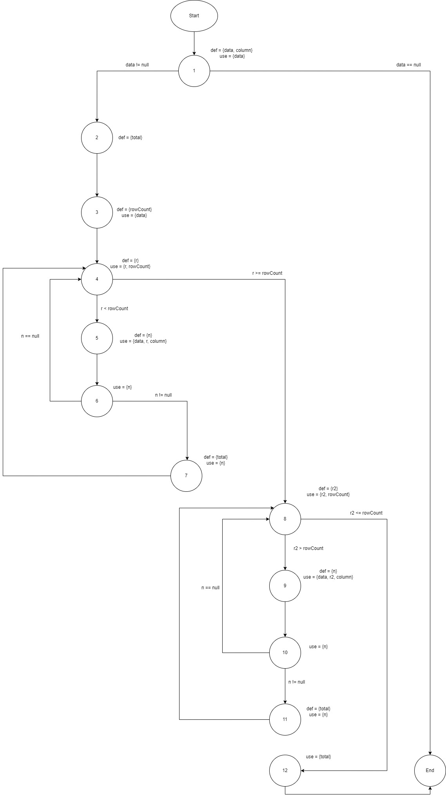

**SENG 438 - Software Testing, Reliability, and Quality**

**Lab. Report #3 – Code Coverage, Adequacy Criteria and Test Case Correlation**

| Group \#:      |  24  |
| -------------- | --- |
| Student Names: | Ahad Ali  |
|                | Mushtaba Al Yasseen  |
|                | Parbir Lehal |
|                | Athul Rajagopal |

(Note that some labs require individual reports while others require one report
for each group. Please see each lab document for details.)

# 1 Introduction

Text…

# 2 Manual data-flow coverage calculations for X and Y methods
Methods: Range.contains() and DataUtilities.calculateColumnTotal()
## Range.contains()
### Dataflow Graph
(need to add)
### Def-path set
### Def-pair set
### DU-Pairs per Variable
### DU-Pairs per Test Case
### DU Pair Coverage
## DataUtilities.calculateColumnTotal()
### Dataflow Graph

### Def-path set
- du(1, data) = { [1], [1, 2, 3], [1, 2, 3, 4, 5],  [1, 2, 3, 4, 5, 6, 4,  8, 9], [1, 2, 3, 4, 5, 6, 7, 4,  8, 9], [1, 2, 3, 4, 8, 9] }
- du(1, column) = { [1, 2, 3, 4, 5],  [1, 2, 3, 4, 5, 6, 4,  8, 9], [1, 2, 3, 4, 5, 6, 7, 4,  8, 9], [1, 2, 3, 4, 8, 9] }
- du(2, total) = { [2, 3, 4, 5, 6, 7], [2, 3, 4, 5, 6, 7, 4, 8, 9, 10, 11], [2, 3, 4, 5, 6, 4, 8, 9, 10, 11], [2, 3, 4, 8, 9, 10, 11], [2, 3, 4, 8, 12], [2, 3, 4, 8, 9, 10, 8, 12], [2, 3, 4, 8, 9, 10, 11, 8, 12], [2, 3, 4, 5, 6, 4, 8, 12], [2, 3, 4, 5, 6, 7, 4, 8, 12], [2, 3, 4, 5, 6, 4, 8, 9, 10, 8, 12], [2, 3, 4, 5, 6, 4, 8, 9, 10, 11, 8, 12], [2, 3, 4, 5, 6, 7, 4, 8, 9, 10, 8, 12],  [2, 3, 4, 5, 6, 7, 4, 8, 9, 10, 11, 8, 12] }
- du(3, rowCount) = { [3, 4], [3, 4, 8], [3, 4, 5, 6, 7, 4, 8], [3, 4, 5, 6, 4, 8] }
- du(4, r) = { [4], [4, 5] }
- du(5, n1) = { [5, 6], [5, 7], [5, 6, 4, 5, 6, 7] }
- du(8, r2) = { [8], [8, 9] }
- du(9, n2) = { [9, 10], [9, 10, 11] }
#### Note:
- n1 is the variable n encountered in line 128 in the first for loop.
- n2 is the variable n encountered in line 134 in the second for loop.
### Def-pair set
- du(1, 1, data) = { [1] }
- du(1, 3, data) = { [1, 2, 3] }
- du(1, 5, data) = { [1, 2, 3, 4, 5] }
- du(1, 9, data) = { [1, 2, 3, 4, 5, 6, 4, 8, 9],  [1, 2, 3, 4, 5, 6, 7, 4, 8, 9] ,  [1, 2, 3, 4, 8, 9] }
- du(1, 5, column) = { [1, 2, 3, 4, 5] }
- du(1, 9, column) = { [1, 2, 3, 4, 5, 6, 4,  8, 9], [1, 2, 3, 4, 5, 6, 7, 4,  8, 9], [1, 2, 3, 4, 8, 9] } 
- du(2, 7, total = { [2, 3, 4, 5, 6, 7] }
- du(2,11, total = { [2, 3, 4, 5, 6, 7, 4, 8, 9, 10, 11], [2, 3, 4, 5, 6, 4, 8, 9, 10, 11], [2, 3, 4, 8, 9, 10, 11] }
- du(2, 12, total) = { [2, 3, 4, 8, 12], [2, 3, 4, 8, 9, 10, 8, 12], [2, 3, 4, 8, 9, 10, 11, 8, 12], [2, 3, 4, 5, 6, 4, 8, 12], [2, 3, 4, 5, 6, 7, 4, 8, 12], [2, 3, 4, 5, 6, 4, 8, 9, 10, 8, 12], [2, 3, 4, 5, 6, 4, 8, 9, 10, 11, 8, 12], [2, 3, 4, 5, 6, 7, 4, 8, 9, 10, 8, 12],  [2, 3, 4, 5, 6, 7, 4, 8, 9, 10, 11, 8, 12] }
- du(3, 4, rowCount) = { [3, 4] }
- du(3, 8, rowCount) = { [3, 4, 8], [3, 4, 5, 6, 7, 4, 8], [3, 4, 5, 6, 4, 8] }
- du(4, 4, r) = { [4] }
- du(4, 5, r) = { [4, 5] }
- du(5, 6, n1) = { [5, 6] }
- du(5, 7, n1) = { [5, 7], [5, 6, 4, 5, 6, 7] }
- du(8, 8, r2) = { [8] }
- du(8, 9, r2) = { [8, 9] }
- du(9, 10, n2) = { [9, 10] }
- du(9, 11, n2) = { [9, 11] }
### DU-Pairs per Variable
| Variable (v) | Defined at node (n) | DU Pairs                          |
| ------------ | ------------------- | --------------------------------- |
| data         | 1                   | { (1, 1), (1, 3), (1, 5), (1, 9) } |
| column       | 1                   | { (1, 5), (1, 9) }                |
| total        | 2                   | { (2, 7), (2, 11), (2, 12) }      |
| rowCount     | 3                   | { (3, 4), (3, 8) }                  |
| r            | 4                   | { (4, 4), (4, 5) }                  |
| n1           | 5                   | { (5, 6), (5, 7) }                  |
| r2           | 8                   | { (8, 8), (8, 9) }                  |
| n2           | 9                   | { (9, 10), (9, 11) }                |
### DU-Pairs per Test Case
| Test Case                                    | Pairs Covered                                                                                                                                                                             |
| -------------------------------------------- | ----------------------------------------------------------------------------------------------------------------------------------------------------------------------------------------- |
| calculateColumnTotalForTwoValues()           | du(1, 1, data), du(1, 3, data), du(1, 5, data), du(1, 5, column), du(2, 7, total), du(2, 12, total), du(3, 4, rowCount), du(4, 4, r), du(4, 5, r),  du(5, 6, r), du(5, 7, r), du(8, 8, r) |
| calculateColumnTotalNullData()               | du(1, 1, data)                                                                                                                                                                            |
| calculateColumnTotalEmpty()                  | du(1, 1, data), du(1, 3, data), du(3, 4, rowCount), du(3, 8, rowCount), du(4, 4, r), du(8, 8, r)                                                                                          |
| calculateColumnTotalPositiveTableAndValues() | du(1, 1, data), du(1, 3, data), du(1, 5, data), du(1, 5, column), du(2, 7, total), du(2, 12, total), du(3, 4, rowCount), du(4, 4, r), du(4, 5, r),  du(5, 6, r), du(5, 7, r), du(8, 8, r) |
| calculateColumnTotalNegativeValues()         | du(1, 1, data), du(1, 3, data), du(1, 5, data), du(1, 5, column), du(2, 7, total), du(2, 12, total), du(3, 4, rowCount), du(4, 4, r), du(4, 5, r),  du(5, 6, r), du(5, 7, r), du(8, 8, r) |
| calculateColumnTotalNegativeColumn()         | du(1, 1, data), du(1, 3, data), du(1, 5, data), du(1, 5, column), du(3, 4, rowCount), du(4, 4, r), du(4, 5, r)                                                                            |
### DU Pair Coverage
Total pairs = 19  
Number of unique pairs covered =  13  
**DU pair coverage = Number of unique pairs covered / Total pairs = 13 / 19 * 100% = 68.42%**  

# 3 A detailed description of the testing strategy for the new unit test

For the new unit test, our strategy was to first assess the coverage for both classes with our test suite from the previous assignment. Since we were using EclEmma, which does not have condition coverage, we substituted it with method coverage. Similarly, we substituted line coverage for statement coverage.
### Coverage metrics from A2
- Range.java
    - Statement (Line) coverage: 18.5%
    - Branch coverage: 22.0%
    - Condition (Method) coverage: 26.1%
- DataUtilities.java
    - Statement (Line) coverage: 46.9%
    - Branch coverage: 29.7%
    - Condition (Method) coverage: 60.0%

Then, we took the difference between the target coverage metrics and our current coverage metrics, and divided that by 4, with the idea that each team member would try to increase coverage of the methods they tested in the previous assignment by that amount.
### Target metrics for A3
- Statement (Line) coverage: 90%
- Branch coverage: 70%
- Condition (Method) coverage: 60.0%

So, each person will need to increase coverage by the following amount:
- Range.java
    - Statement (Line) coverage: +17.9%
    - Branch coverage: +12.0%
    - Condition (Method) coverage: +8.5%
- DataUtilities.java
    - Statement (Line) coverage: +10.8%
    - Branch coverage: +10.1%
    - Condition (Method) coverage: technically 0, but cover at least one additional method

Our priority for increasing coverage was to first increase the line and branch coverage for our previous methods to the target metrics per person stated above. Then, once we had achieved that level of coverage or could not increase it further, we would increase the method coverage by testing new methods, until we reached the target metrics for condition (in this case, method) coverage.

# 4 A high level description of five selected test cases you have designed using coverage information, and how they have increased code coverage

Text…

# 5 A detailed report of the coverage achieved of each class and method (a screen shot from the code cover results in green and red color would suffice)

Text…

# 6 Pros and Cons of coverage tools used and Metrics you report

Text…

# 7 A comparison on the advantages and disadvantages of requirements-based test generation and coverage-based test generation.

Text…

# 8 A discussion on how the team work/effort was divided and managed

Text…

# 9 Any difficulties encountered, challenges overcome, and lessons learned from performing the lab

As mentioned previously, we did have to deal with some constraints of using EclEmma as our coverage tool, since we could not test condition coverage as was originally intended. Given that we used method coverage as a substitute, this meant we had to write tests for methods that we had not tested previously. This required reading through additional documentation in the JavaDoc, so we could properly understand the intended functionality of these additional methods.  
  
Furthermore, we faced some difficulty when trying to increase the statement or branch coverage of the methods we tested in the previous assignment. Upon further inspection, we realized that there were certain cases where increasing coverage was impossible, as the remaining statements or branches were unreachable. This was either due to redundant code or faulty logic. An example of the former can be seen in Range.java, where the Range constructor checks for invalid ranges, but several of its methods do the same unnecessarily. On the other hand, methods like DataUtilities.getCumulativePercentages() had for loops where the condiiton would never be met, meaning none of the code inside the loops were reachable.
  
Consequently, we realized that white box testing can be useful not only for code that can be reached, but for detecting code that is impossible to reach as well. Moreover, our testing capabilities are ultimately constrained by the tools we use, despite whatever initial testing plans we may have. For this reason, it is wise to research and choose testing tools that suit our needs prior to testing.

# 10 Comments/feedback on the lab itself

Text…
